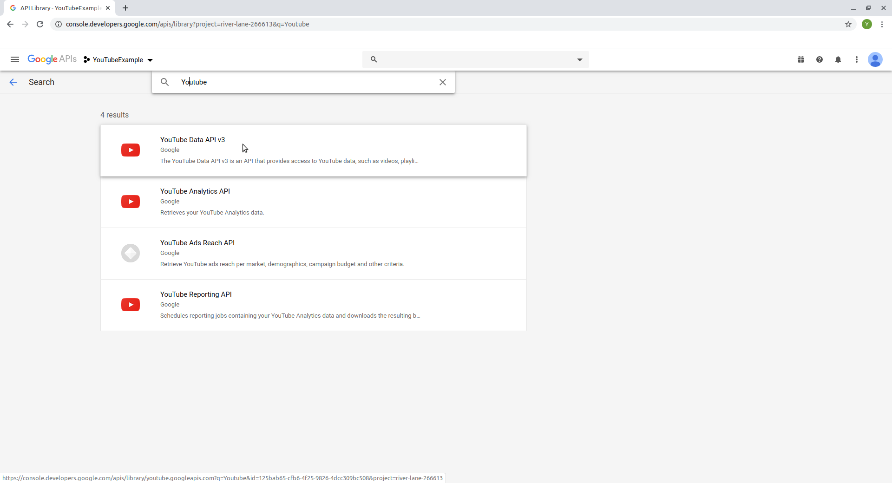
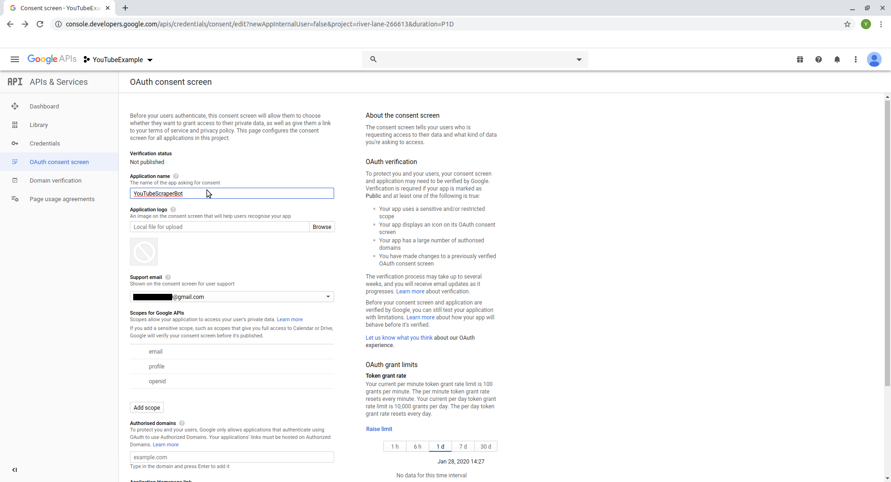
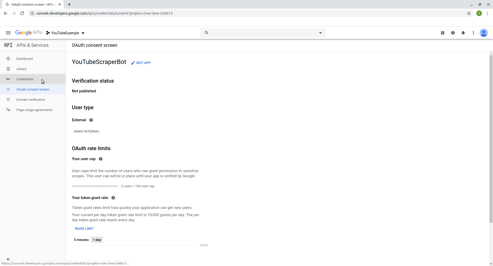

layout: true

```{r setup, include = F}
if (!require(easypackages)) install.packages("easypackages")
library(easypackages)

packages("knitr", "rmarkdown", "tidyverse", "kableExtra", "hadley/emo", "tuber", prompt = F)

options(htmltools.dir.version = FALSE, stringsAsFactors = F)

opts_chunk$set(echo = TRUE, fig.align = "center")

```

<div class="my-footer">
  <div style="float: left;"><span>`r gsub("<br />", ", ", gsub("<br /><br />|<a.+$", "", metadata$author))`</span></div>
  <div style="float: right;"><span>`r metadata$location`, `r metadata$date`</span></div>
  <div style="text-align: center;"><span>`r gsub(".+<br />", " ", metadata$subtitle)`</span></div>
</div>

---


# Setting up API access to the *YouTube* API
 
To effectively work with *YouTube* data, we need access to its Application Programming Interface (API). As this process, unfortunately, can be a bit tedious, we prepared this preliminary tutorial so you don't have to spend time setting up your API access during the workshop. Please follow this tutorial and check if the setup works before the workshop. If your setup does not work, feel free to contact us before the workshop (the sooner the better) and we'll try to assist you in setting up access to the *YouTube* API. If, for some reason, setting up access to the API does not work for you and we don't find a solution or if you cannot access the API during the workshop, we will have some data prepared that you can then work with in the workshop.
  
[HINT](https://en.wikipedia.org/wiki/YouTube): Pink texts are hyperlinks to the respective website that you can simply click on

---
# Setting up API Access
  
- For starters, you need a *Google* account
- You can use an existing one or create a new one
- We suggest that you create a new account (if you accidentally share your login credentials, people using the credentials only have access to this account and not your personal or work account)

- You can create a new account [here](https://accounts.google.com/signup/v2/webcreateaccount?service=mail&continue=https%3A%2F%2Fmail.google.com%2Fmail%2F&ltmpl=googlemail&gmb=exp&biz=false&flowName=GlifWebSignIn&flowEntry=SignUp)

- Next, we need to:
  - Sign up for the *Google* developer console
  - Create a new project
  - Activate the *YouTube* Data API
  - Create authentification credentials
  - Test the credentials

We will explain these steps in detail on the following slides.

---
# Google Developer Console
  
- Go to the [Developer Console](https://console.developers.google.com) and log in with your (new) *Google* Account


---
# Google Developer Console

- Create a new project by clicking the "Create" button in the top right corner


---
# Project Limit
  
- You only have a limited number of Projects that you can create, so be careful not
to constantly delete and create new ones!

- More information on project limits can be found [here](https://support.google.com/cloud/answer/6330231)

---
# Creating a New Project
  
- Specify a project name (you do not have to specify an organisation) and click "create" once you are done


---
# Activate the YouTube Data v3 API
  
- Click the button "Enable APIs and Services"


---
# Activate the YouTube Data v3 API
  
- Enter "YouTube" in the search bar


---
# Activate the YouTube Data v3 API

- Click on "YouTube Data API v3" 



---
# Activate the YouTube Data v3 API

- Activate the API by clicking the "Enable" button


---
# Obtaining OAuth credentials

- The API is now enabled, but we still need credentials to use it

- Click on the "Credentials" pane in the menu on the left side


---
# Obtaining OAuth credentials

- Click the "+ Create Credentials" button and select "OAuth Client ID" from the dropdown menu


---
# Obtaining OAuth credentials

- To be able to create new credentials, we first need to configure a consent screen for our "app"

- Click the blue "Configure Consent Screen" button on the right side of your screen


---
# Configuring the Consent Screen

- Enter the name of your "app" in the the field "application name", scroll to the bottom of the page, and click "save"




---
# Obtaining OAuth credentials

- On the following screen, select the "Credentials" pane again from the menu on the left side of your screen



---
# Obtaining OAuth Credentials

- Select the application type "other" and enter a name for your set of credentials. Afterwards, click "create".


---
# OAuth Credentials Obtained

- You now have our first set of OAuth credentials for using the YouTube API

- Don't worry about closing the window, we can access them again anytime


---
# A Few Words of Advice on Handling Your *YouTube* API Access

- Have one account and project ready for the workshop for which you know that it works
- Do not use your API access too excessively before the workshop to avoid any risk of it being suspended
  
- Never share your OAuth login credentials! This can easily happen by accident when
  - saving code in a GitHub Repo
  - sending scripts to colleagues
  - troubleshooting someone elses code
  - for added security you can use the [`keyring` package](https://cran.r-project.org/web/packages/keyring/keyring.pdf) (we'll say a bit more about this in the workshop)
  
---
# Testing Access

- You can try whether your *YouTube* API access works as intendend by running the 
  following commands in `R`:

```{r eval = FALSE}
# installing the tuber package
install.packages("tuber")

# loading tuber package
library(tuber)

# Your Credentials (NEVER SHARE THIS INFORMATION)
ID <- "ENTER-YOUR-APP-ID"
secret <- "ENTER-YOUR-APP-SECRET"

# authentication
yt_oauth(ID,secret)

# You will be asked in the R-console to
# save an access token: Select no

# You will be send to your browser to
# login with your account

```
---
# Login 

- Select the *Google* Account that you used to set up the credentials


---
# Granting Access to Your "Unsecure App" (1)

- As we did not verify our "App", *Google* labels it as "unsecure"
- Because we're the only ones using it, this shouldn't bother us. Click "Advanced" on the bottom left


---
# Granting Access to Your "Unsecure App" (2)

- Click "Go to [Name of your App] (unsafe)" on the bottom left of your screen


---
# Granting Access to Your "Unsecure App" (3)

- Click "Allow"


---
# Access "Unsecure App" (1)

- Click "Allow" again to confirm your choice


---
# Access "Unsecure App" (2)

- You should now see the message "Authentication complete. Please close this page and return to R"


---
# Test API call

- To check if everything worked, let's try to collect some data about a video

```{r eval = FALSE}

# get statistics of 1 video
get_stats(video_id="HluANRwPyNo")

```

---
# Output

- If everything worked correctly, your output should look something like this:

```{r eval = FALSE}
$id
[1] "HluANRwPyNo"

$viewCount
[1] "10244939"

$likeCount
[1] "509791"

$dislikeCount
[1] "4799"

$favoriteCount
[1] "0"

$commentCount
[1] "20581"
```
---
class: center, middle

# We hope that you are now all set up and look forward to seeing you in Cologne!
