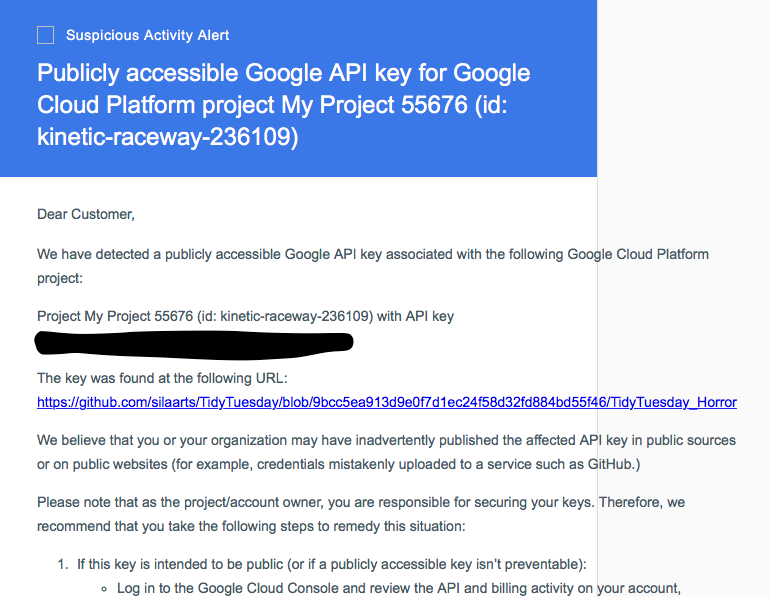

layout: true

```{r setup, include = F}
if (!require(easypackages)) install.packages("easypackages")
library(easypackages)

packages("knitr", "rmarkdown", "tidyverse", "kableExtra", "hadley/emo", "tuber", prompt = F)

options(htmltools.dir.version = FALSE, stringsAsFactors = F)

opts_chunk$set(echo = TRUE, fig.align = "center")

```

<div class="my-footer">
  <div style="float: left;"><span>`r gsub("<br />", ", ", gsub("<br /><br />|<a.+$", "", metadata$author))`</span></div>
  <div style="float: right;"><span>`r metadata$location`, `r metadata$date`</span></div>
  <div style="text-align: center;"><span>`r gsub(".+<br />", " ", metadata$subtitle)`</span></div>
</div>

---

# The `tuber` Package

With the [`tuber` package](https://github.com/soodoku/tuber) you can access the *YouTube* API via `R`. The author of the package has written a short [vignette](https://cran.r-project.org/web/packages/tuber/vignettes/tuber-ex.html) to introduce some of its main functions.

Essentially, there are three main units of analysis for which you can access data with the `tuber` package:

- Videos (requires video IDs)
- Channels (requires channel IDs)
- Playlists (requires playlist IDs)

In this workshop, we will focus on individual **videos**.

---

# Setup

```{r packages, eval = F}
install.packages("tuber")
install.packages("tidyverse")
library(tuber)
library(tidyverse)
options(stringsAsFactors = FALSE)
```

---

# Excursus: Keep Your Secrets Secret (1)

If you save your API credentials in an `R` script, anyone who has that script can potentially use your API key. This can affect your quota and might even cause costs for you.

```{r cases, out.width = "60%", echo = F}

```
.center[
<small><small>Source: https://twitter.com/sil_aarts/status/1187352423796477953</small></small>
]

---

# Excursus: Keep Your Secrets Secret (2)

If you use `R` environment variables, your credentials won't be shared if you share your scripts. However, the information is still stored in a plain text file. You can run `usethis::edit_r_environ()` to see its contents.

One way of keeping your credentials safer is using the `keyring` package.

```{r keyring setup, eval = F}
install.packages("keyring")
library(keyring)
```

---

# Excursus: The `keyring` Package

To store your credentials in an encrypted password-protected keyring you first need to create a new keyring.

```{r create keyring, eval = F}
keyring_create("YouTube_API")
```

You will then be prompted to set a password for this keyring. As always: This password should ideally be easy to remember (for you) but hard to guess (for anyone else). You might want to write it down or store it in your password manager (if you use one). In the next step, you can store your *YouTube* app secret in the keyring.
```{r set key, eval = F}
key_set("app_secret", 
        keyring ="YouTube_API")
```

When you are prompted to enter the password, now you should enter your app secret. After that - as well as whenever you unlock a keyring to use the credentials stored inside - you should lock the keyring again.
```{r lock keyring, eval = F}
keyring_lock("YouTube_API")
```

---

# Authenticate Your App

```{r authenticate plain, eval = F}
yt_oauth(app_id = "my_app_id", # paste your app ID here
         app_secret = "my_app_secret", # paste your app secret here
         token="")
```
or, if you stored your app secret in a keyring

```{r authenticate keyring, eval = F}
yt_oauth(app_id = "my_app_id",  # paste your app ID here
         app_secret = key_get("app_secret", keyring ="YouTube_API"),
         token="")
```

---

# Authentication

When running the `yt_oauth()` function, there will be a prompt in the console asking you whether you want to save the access token in a file. If you select "Yes", `tuber` will create a local file (in your working directory) to cache [OAuth](https://en.wikipedia.org/wiki/OAuth) access credentials between `R` sessions. The token stored in this file will be valid for one hour (and can be automatically refreshed). Doing this makes sense if you know you will be running multiple `R` sessions that need your credentials (example: knitting an `RMarkdown` document). 

Similar to the app key and secret, you should never share the `.httr-oauth` file as it can be read in `R` using `readRDS()` (the file contains a list with your app ID and the access token). Hence, it is usually ok (and safer) to select "No" when asked whether to store a local `.httr-oauth` file. 

---

# App Authorization (1)

After making your choice regarding the `.httr-oauth` file, a browser window should open, prompting you to log in with your *Google* account and to give permissions.


---

# App Authorization (2)

 *Google* will mark the app as unsecure as it has not been verified. However, since you created the app and presumably are its sole user, you can go ahead and trust yourself: Click "Extended".


# App Authorization (3)

Click "Go to Name_of_your_app(unsafe)".


---

# App Authorization (4)

Click "Allow" to grant the app the required permissions this your account.


---

# App Authorization (5)

Click "Allow" again to confirm your choice


---

# App Authorization (6)

After that, you can close the browser tab/window and return to `R`.


---

# Channel Statistics (1)

After authorizing your app, you can start by getting some statistics for a channel. You can find the channel ID by searching on the *YouTube* website and then choosing Type = Channel from the options in the filter menu. When you click on the channel you want in the search results, you see the channel ID at the end of the URL (after "/channel/").

```{r YouTube oauth, echo = F}
yt_oauth()
```

```{r channel stats}
hadley_stats <- get_channel_stats("UCxOhDvtaoXDAB336AolWs3A")
```

Note: If you want additional data on channels/video creators and their performance on *YouTube*, you can also check out the statistics provided by [*Socialblade*](https://socialblade.com/youtube/).

---

# Channel Statistics (2)

`get_channel_stats` returns a list which can then be wrangled into a dataframe (or a a tibble as in the code below).

```{r channel stats to df}
hadley_stats_df <- hadley_stats$statistics %>% 
  as_tibble() %>% 
  mutate_at(vars(-hiddenSubscriberCount), as.numeric) %>% 
  mutate(channel_id = hadley_stats$id,
         channel_name = hadley_stats$snippet$title,
         channel_published = hadley_stats$snippet$publishedAt)

hadley_stats_df

```

---

# Video Statistics

The video IDs are the last 11 characters of the video URL. Example: https://www.youtube.com/watch?v=DcJFdCmN98s -> ID = DcJFdCmN98s

```{r video stats}
dayum_stats <- get_stats("DcJFdCmN98s")

dayum_stats <- dayum_stats %>%
  as_tibble() %>% 
  mutate_at(vars(-id), as.numeric)

dayum_stats
```

---

# Viewer Comments

There are two functions for collecting viewer comments for specific videos (both return a dataframe):

1. `get_comment_threads()` collects comments for a video. By default, it collects the 100 most recent comments. The number of comments can be changed with the argument `max_results` (needs to be >= 20). If the number is > 100, the function fetches all results (see `?get_comment_threads`). **NB:** This function does not collect replies to comments.

2. `get_all_comments()` collects all comments for a video, including replies to comments. **NB:** For some reason, this function only collects up to 5 replies per comment (the related [issue in the `tuber` GitHub repo](https://github.com/soodoku/tuber/issues/52) is still open). Depending on the number of comments for a video, running this function can take some time and might also deplete your API quota limit (more on that later).

---

# Other Useful `tuber` Functions

`get_video_details("video_id")`: list with metadata for the video (e.g., title, description, tags)

`get_all_channel_video_stats("channel_id")`: list with statistics for all videos in a channel

`get_playlists(filter=c(channel_id="channel_id"))`: list with playlists for a channel

`get_playlist_items(filter=c(playlist_id="playlist_id"))`: dataframe with items from a playlist

For the full list of functions in the package, see the [`tuber` reference manual](https://cran.r-project.org/web/packages/tuber/tuber.pdf).

---

# Searching Video IDs (1)

`tuber` provides the function `yt_search()` to use the API to search *YouTube*. However, using this function is extremely costly in terms of API queries. 

A single search query with the `yt_search()` function can easily exceed your daily quota limit as by default, it returns data for all search results (you can check the number of results for a search query via the *YouTube* Data API Explorer). Hence, if you want to use the `yt_search()` function, we would strongly recommend setting the `get_all` argument to `FALSE`. This returns up to 50 results.

```{r yt_search, eval = F}
yt_search(term = "tidyverse",
          get_all = F) #<<
```

---

# Searching Video IDs (2)

There are two alternatives to using the `yt_search()` function from the `tuber` package to search for *YouTube* video IDs:

1. Manual search via the *YouTube* website: This works well for a small number of videos but is not really feasible if you want a large number of video IDs for your analyses.

2. Web scraping: [Freelon (2018)](https://www.tandfonline.com/doi/abs/10.1080/10584609.2018.1477506?journalCode=upcp20) argues that researchers interested in social media and other internet data should know/learn how to scrape the web in what he calls the "post-API age". However, you should use this method with caution. The [robots.txt of *YouTube*](https://www.youtube.com/robots.txt) disallows the scraping of results pages. In practical terms, the (over)use of web scraping might, e.g., get your IP address blocked (at least temporarily). A complete introduction to web scraping would be beyond the scope of this workshop, but we have created some slides with a short tutorial (in the folder with the slides on the *YouTube* API) and there are many online tutorials on this (e.g., [this one](https://blog.rsquaredacademy.com/web-scraping/)). 

---

# Collecting Comments for Multiple Videos

If you want to collect comments for multiple videos, you need a vector with all video IDs (in the code example below, this vector is named `video_ids`). If you have that, you can use `map_df()` from the [`purrr` package](https://purrr.tidyverse.org/) to iterate over video IDs and create a combined dataframe (of course, you could also do this with a for-loop).

```{r comments map_df, eval = F}
comments <- purrr::map_df(.x = video_ids,
                          .f = get_all_comments)
```

**Important notice:** Be aware that your daily API quota limit very likely won't allow you to collect all comments for videos with a high number of comments.

---

# YouTube API Quota Limits

In order to be able to estimate the quota costs of a specific API call via the `tuber` package, you need to know the specific queries that the function you use produces. If you want to do this, you can print the function code (you can do this in `R` by executing the function name without `()` at the end: e.g., `get_stats`). You can then use the information from that code for the [Quota Calculator](https://developers.google.com/youtube/v3/determine_quota_cost) or the API Explorer (by clicking on the respective method in the [YouTube API documentation](https://developers.google.com/youtube/v3/docs/)). The help file for the function of interest can also be useful here (`?get_stats`).

---

# `tuber` Function Code

```{r tuber function code}
get_stats
```

---

# Exemplary Quota Costs for `tuber` Functions

```{r tuber quota cost examples, echo = F}
quota_costs <- data.frame(
  "Function" = c("get_channel_stats('channel_id')", "get_stats('video_id')", "get_comment_threads('video_id', max_results = 100)"),
  "Costs" = c(5, 3, 3),
  "API resource" = c("Channels", "Videos", "CommentThreads"),
  "API method" = rep("list", 3),
  "API parts" = c("statistics,snippet", "statistics", "snippet"),
  stringsAsFactors = FALSE,
  check.names = FALSE
)

quota_costs %>% 
  kable("html") %>% 
  kable_styling(font_size = 14)
```

Be aware that the costs increase with the number of returned items/results.
For reference: `yt_search()` has a quota cost of 102 per page of results (with a default number of max. 50 results per page).

---

# How do I Know the Quota Costs When I use `tuber`?

a) Estimate the costs based on costs for the specific query and the number of returned results. For example, if a video has 4000 comments (without replies) and you wish to collect all of them, you can estimate your cost as follows: 100 results per page = 40 pages & cost per page for `get_comment_threads()` = 5 -> overall cost = 200. In practice, this is a bit more difficult to estimate as both the website of the video and `get_stats()` give you the comment count including replies.

b) Use the *Google* Cloud Console for your app to monitor your API quota use.

---

# Managing Your API Quota

The daily quota for your app resets at midnight Pacific Time. There are 3 ways of dealing with the quota limit:

1. Schedule your scripts. You can either do this manually (by splitting your data collection into batches and running the scripts on different days) or automatically (e.g., using the [taskScheduleR package](https://github.com/bnosac/taskscheduleR) for Windows or the [cronR package](https://github.com/bnosac/cronR) for Linux/Unix).

2. Request an increase through the Quotas menu in the developer console for your app mentioned previously. However, this will quite likely cost money and Ro has already told you how tedious this process is.

3. Use multiple apps and/or accounts for your data collection. This requires some manual scheduling/planning. Keep in mind that there is a limited number of projects per account for the *Google* Cloud Platform. Note that - depending on your setup and use - this strategy might get your API quota, app(s), account(s) or IP address(es) suspended/blocked (at least temporarily). 

---

# Manual Quota Limit Management Example

If you want to use `yt_search()` and want more than 50 search results, you can use the `page_token` argument to get more than one page of results.

```{r yt_search page token, eval = F}
search_p1 <- yt_search(term = "search term",
                       simplify = F, #<<
                       get_all = F)

page_token <-search_p1$nextPageToken

search_p2 <- yt_search(term = "search term",
                       get_all = F,
                       page_token = page_token) #<<

# turn search_p1 from a list into a dataframe
search_p1 <- lapply(search_p1$items, function(x) unlist(x$snippet))
search_p1 <- plyr::ldply(search_p1, rbind)

search_results <- bind_rows(search_p1, search_p2)
```

---

class: center, middle

# [Exercise](https://jobreu.github.io/youtube-workshop-gesis-2020/exercises/A4_tuber_exercises_question.html) time `r ji("weight_lifting_woman")``r ji("muscle")``r ji("running_man")``r ji("biking_man")`

## [Solutions](https://jobreu.github.io/youtube-workshop-gesis-2020/solutions/A4_tuber_exercises_solution.html)