# Setting up API Access

- To effectively work with YouTube data, we need access to it's Application Programming Interface (API)

- As this process can be quite tedious, we prepared this preliminary tutorial so nobody
  has to spend time troubleshooting their API access during the workshop
  
- Please follow this tutorial and check if the setup works before the workshop

- If your setup does not work, feel free to contact us in a timely manner for assistance with trouble shooting

- In case API access is suspended or fails for some participants, we will have prepared datasets on site that
  you can still work with
  
- [HINT](https://en.wikipedia.org/wiki/YouTube): Pink texts are hyperlinks to the respective website that you can simply click on

---
# Setting up API Access
  
- First of all, we need a Google account.
- You can use an already existing one or create a new one
- For safety reasons, we advise you to create a new account
  (If you accidentally share your login credentials, people using the credentials only
  have access to your Bot account and not your personal or work account)
- You can create a new account [here](https://accounts.google.com/signup/v2/webcreateaccount?service=mail&continue=https%3A%2F%2Fmail.google.com%2Fmail%2F&ltmpl=googlemail&gmb=exp&biz=false&flowName=GlifWebSignIn&flowEntry=SignUp)

- Second, we need to:
  - Sign up for the Google developer console
  - Create a new Project
  - Activate the YouTube Data API
  - Create Authentification Credentials
  - Test the credentials

---
# Google Developer Console
  
- Go to the [Developer Console](https://console.developers.google.com) and log in with your new Google Account


---
# Google Developer Console

- Create a new Project by clicking on the "Create" button on the top right Corner

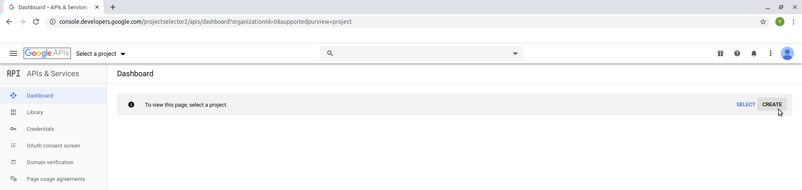

---
# Watch out!
  
- You only have a limited number of Projects that you can create, so be carefull not
to constantly delete and create new ones!

- More information on project limitations can be found [here](https://support.google.com/cloud/answer/6330231)

---
# Creating a New Project
  
- Specify a project name (you do not have to indicate an organisation) and click on "create" once you are done

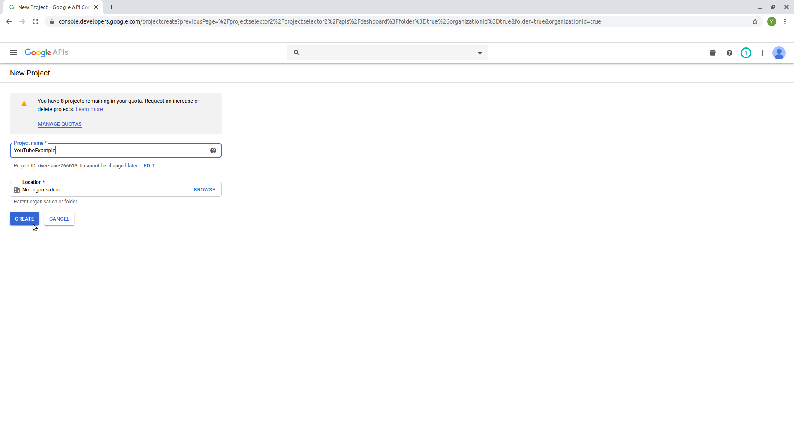

---
# Activate the YouTube Data v3 API
  
- Click on the button to "Enable APIs and Services" on the top of your screen

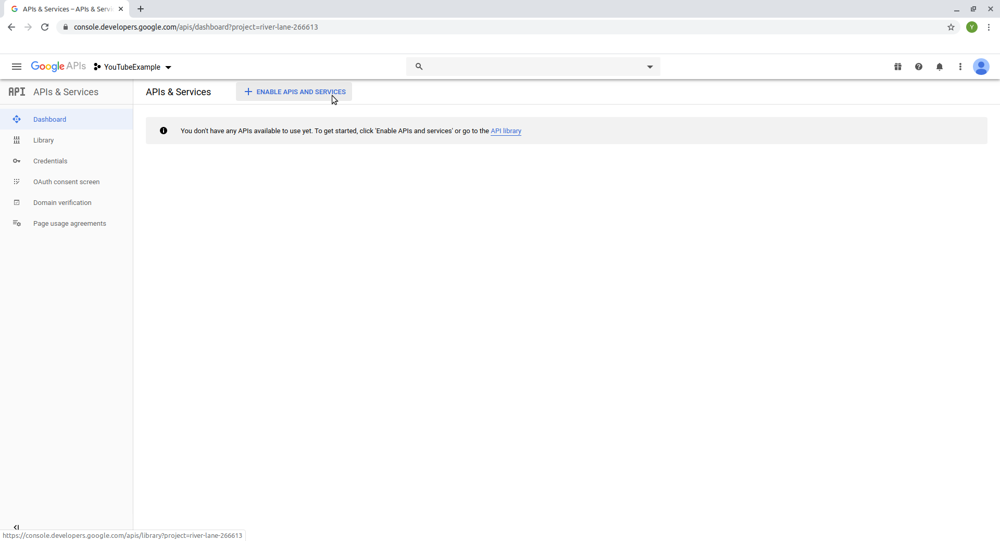

---
# Activate the YouTube Data v3 API
  
- Enter "Youtube" in the search bar

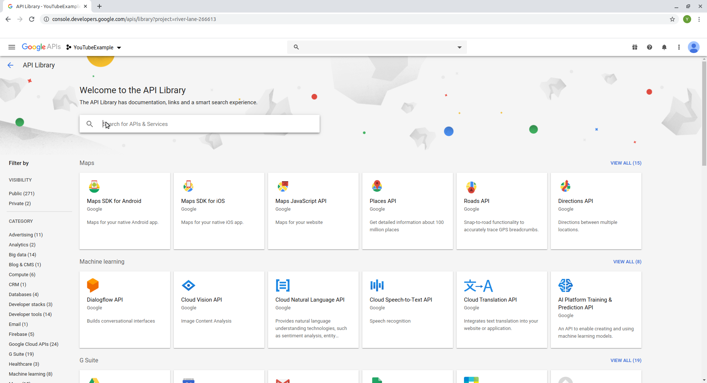

---
# Activate the YouTube Data v3 API

- Click on "YouTube Data API v3" 


---
# Activate the YouTube Data v3 API

- Activate the API by clicking on the "Enable" button

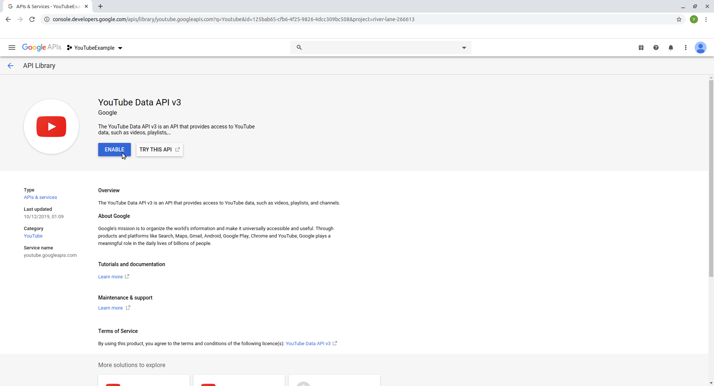
---
class: center, middle

# The API is now enabled! But we still need credentials to use it.

---
# Obtaining OAuth Credentials

- Click on the "Credentials" pane in the menu on the left side

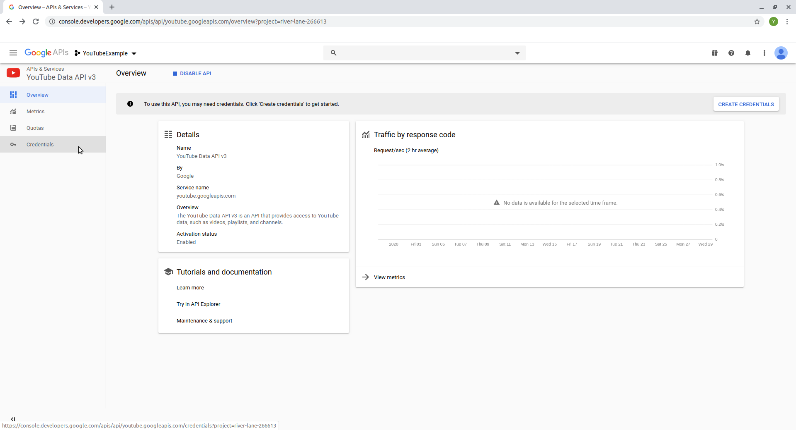

---
# Obtaining OAuth Credentials

- Click on the "+ Create Credentials" button on the top of your screen and select "OAuth Client ID" from the drop
  down menu

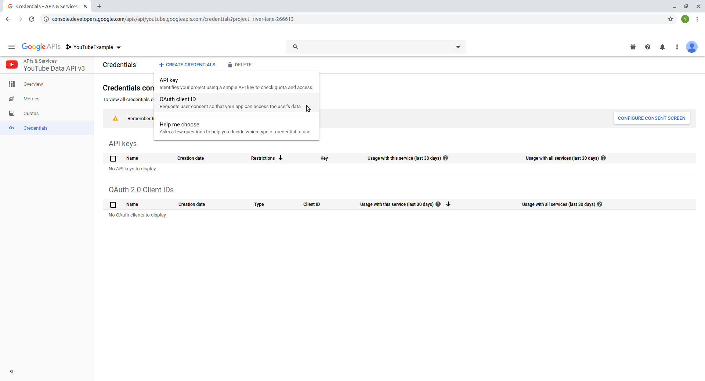

---
# Obtaining OAuth Credentials

- To be able to create new credentials, we first need to configure a consent screen for our "App"

- Click on the blue button saying "Configure Consent Screen" on the right side of your screen

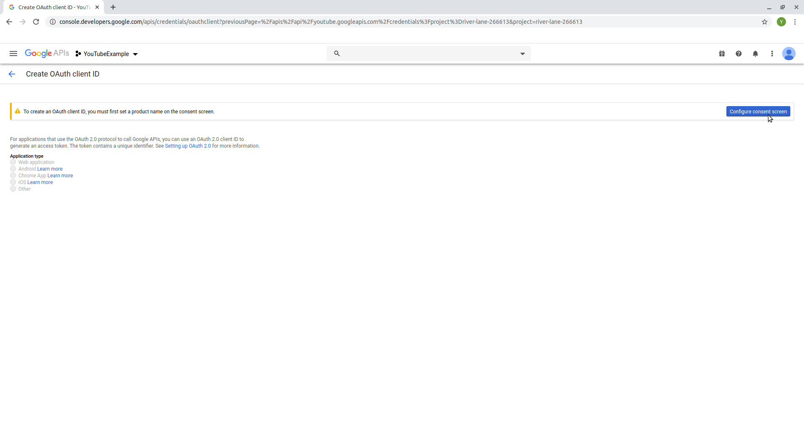

---
# Configuring Consent Screen

- Fill the field "application name" with a name for your "App", scroll to the bottom of the page 
  and click "save"


---
# Obtaining OAuth Credentials

- On the following screen, select the "Credentials" pane again from the menu on the left side of your screen


---
# Obtaining OAuth Credentials

- We can now specify our credentials! Select the application type "other" and enter a name for your
  set of credentials. Afterwards, click on "create".

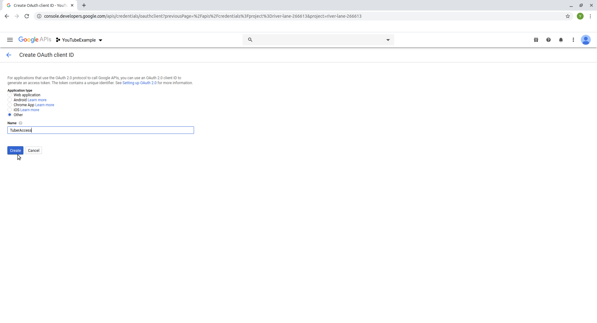

---
# Success!

- We now have our first set of OAuth credentials for using the YouTube API!

- Don't worry about closing the window, we can access them again anytime

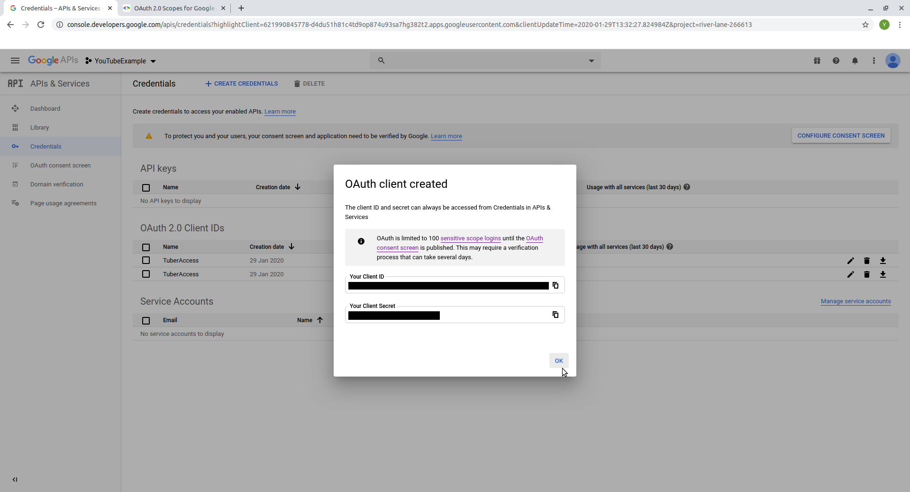

---
# Words of Advice

- Have one account and project ready for the workshop that you know works but do not use too excessively in advance to
  not get it suspended before the workshop
  
- Never ever share your login credentials! This can easily happen by accident when
  - saving code in a GitHub Repo
  - sending scripts to colleages
  - Troubleshooting someone elses code
  - For added security, you can use the [Keyring package](https://cran.r-project.org/web/packages/keyring/keyring.pdf) (more info in workshop)
  
---
class: center, middle

# The API is now ready to use, but we still need to test if everything is working

---
# Testing Access

- You can try whether your account works as intendend without using it too excessively by running the 
  following commands in R. This should open a browser window:

```{r eval = FALSE}
# installing the tuber package
install.packages("tuber")

# loading tuber package
library(tuber)

# Your Credentials (NEVER SHARE THIS INFORMATION)
ID <- "ENTER-YOUR-APP-ID"
secret <- "ENTER-YOUR-APP-SECRET"

# authentication
yt_oauth(ID,secret)

# You will be asked in the R-console to
# save an access token: Select no

# You will be send to your browser to
# login with your account

```
---
# Login 

- Select the Google Account that you used to set up the credentials

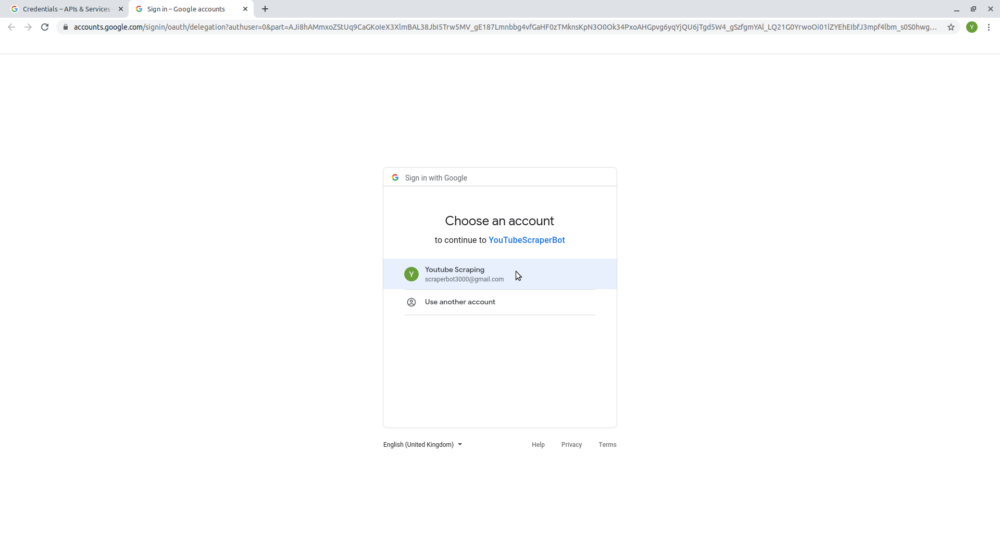
---
# Access "unsecure App"

- We did not verify our "App", this is why Google labels it as "unsecure". Because we're the only ones using it,
  this doesn't bother us. Click on "Advanced" on the bottom left


---
# Access "unsecure App"

- Click on "Go to [Name of your App] (unsafe)" on the bottom left of your screen


---
# Access "unsecure App"

- Click on "Allow"


---
# Access "unsecure App"

- Click on "Allow" again to confirm your choice

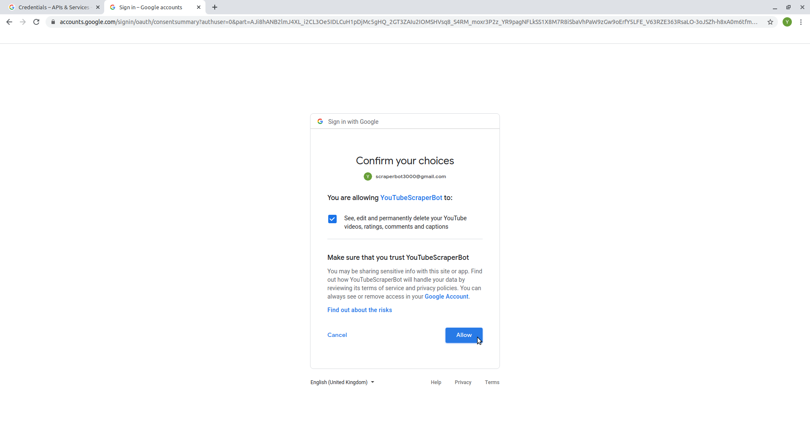
---
# Access "unsecure App"

- You should now see the message "Authentication complete. Please close this page and return to R"


---
# Test API call

- To check if everything worked, lets try to get some info about a video

```{r eval = FALSE}

# get statistics of 1 video
get_stats(video_id="HluANRwPyNo")

```

---
# Output

- If everything worked correctly, your output should look something like this:

```{r eval = FALSE}
$id
[1] "HluANRwPyNo"

$viewCount
[1] "10244939"

$likeCount
[1] "509791"

$dislikeCount
[1] "4799"

$favoriteCount
[1] "0"

$commentCount
[1] "20581"
```
---
class: center, middle

# We are looking forward to seeing you in Cologne!

---
